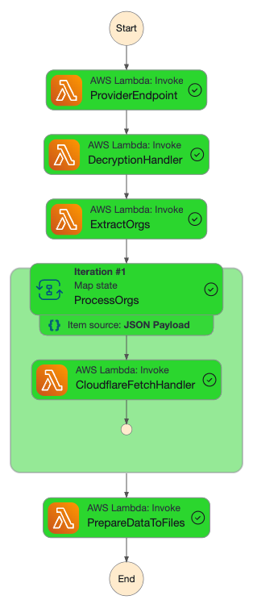

# AWS Step Functions State Machine

This project creates an AWS Step Functions state machine that processes data from Cloudflare using Lambda functions.

## State Machine Visualization



## Data Storage Structure

The processed data is stored in S3 with the following structure:

```
s3://<bucket-name>/
├── <org-id>/
│   └── <timestamp>/
│       ├── data.json    # Raw JSON data from Cloudflare
│       └── data.csv     # Flattened CSV format of the same data
```

### File Naming Convention

- Data files: `<timestamp>/data.{json|csv}`
  - Example: `148/2024-03-20T10:30:00Z/data.json`
  - Example: `1482024-03-20T10:30:00Z/data.csv`

### File Contents

1. **JSON Data** (`data.json`):
```json
{
  "orgId": "org_123",
  "timestamp": "2024-03-20T10:30:00Z",
  "connectorParams": {
    "exchange_id": "exchange_123",
    "ticker_symbol": "TICK"
  },
  "radarData": {
    // Raw Cloudflare API response data
  }
}
```

2. **CSV Data** (`data.csv`):
- Contains the same data as JSON but in flattened CSV format
- Headers are automatically generated from the data structure
- Nested data is represented using dot notation (e.g., "radarData.result.location")

## Prerequisites

- Node.js 18 or later
- AWS CLI configured with appropriate credentials
- AWS Vault installed and configured
- TypeScript (`npm install -g typescript`)

## Project Structure

```
runtime-state-machine/
├── src/
│   ├── lambda/
│   │   ├── providerEndpoint.ts
│   │   ├── decryptionHandler.ts
│   │   ├── extractOrgs.ts
│   │   ├── cloudflareFetchHandler.ts
│   │   ├── prepareDataToFiles.ts
│   │   └── types.ts
│   ├── createStateMachine.ts
│   └── triggerStateMachine.ts
├── package.json
└── tsconfig.json
```

## Lambda Functions

### 1. Provider Endpoint (`providerEndpoint.ts`)
**Purpose**: Simulates fetching data from a provider
**Functionality**:
- Generates mock provider data
- Simulates API response delay
- Returns encrypted data payload
**Input**: None
**Output**: Encrypted provider data
**Error Handling**: Simulates network errors and timeouts

### 2. Decryption Handler (`decryptionHandler.ts`)
**Purpose**: Decrypts provider data
**Functionality**:
- Receives encrypted data from provider
- Simulates decryption process
- Validates decrypted data structure
**Input**: Encrypted provider data
**Output**: Decrypted data payload
**Error Handling**: Invalid encryption, corrupted data

### 3. Extract Organizations (`extractOrgs.ts`)
**Purpose**: Extracts organization data from decrypted payload
**Functionality**:
- Parses decrypted data
- Extracts organization details
- Validates organization data
- Filters active organizations
**Input**: Decrypted data payload
**Output**: Array of organization objects
**Error Handling**: Invalid data format, missing required fields

### 4. Cloudflare Fetch Handler (`cloudflareFetchHandler.ts`)
**Purpose**: Fetches data from Cloudflare API
**Functionality**:
- Makes API calls to Cloudflare
- Uses organization's connector parameters
- Processes API responses
- Handles rate limiting
**Input**: Organization data
**Output**: Cloudflare radar data
**Error Handling**: API errors, rate limits, timeouts
**Security Note**: Uses hardcoded API token: `QXDe4BmrYtYR7poGBp6INlMTDYGLZ5CEYn6HLk0U`

### 5. Prepare Data to Files (`prepareDataToFiles.ts`)
**Purpose**: Prepares and saves data to S3
**Functionality**:
- Saves raw JSON data
- Converts data to flattened CSV format
- Uploads both formats to S3
- Handles upload errors
**Input**: Processed data
**Output**: S3 file locations
**Error Handling**: S3 upload failures, permission issues

## Setup

1. Install dependencies:
   ```bash
   npm install
   ```

2. Build the project:
   ```bash
   npm run build
   ```

3. Create the state machine and its resources using AWS Vault:
   ```bash
   aws-vault exec <your-profile> -- npm start
   ```
   Replace `<your-profile>` with your AWS profile name (e.g., `dil-team-vibranium`)

4. Trigger the state machine manually:
   ```bash
   aws-vault exec <your-profile> -- node dist/triggerStateMachine.js "<state-machine-arn>"
   ```

## State Machine Flow

1. `ProviderEndpoint` → `DecryptionHandler` → `ExtractOrgs` → `CloudflareFetchHandler` → `PrepareDataToFiles`

## Environment Variables

- `AWS_REGION`: AWS region (default: us-west-2)
- `BUCKET_NAME`: S3 bucket name for storing processed data (default: stepfunction-poc-bucket-12345)

## IAM Roles and Permissions

The project creates and manages the following IAM roles:
- `StepFunctionLambdaRoleLatest`: Role for Lambda functions with permissions for:
  - CloudWatch Logs
  - S3 access
  - Lambda execution
  - Step Functions execution

## EventBridge Rule

An EventBridge rule is created to trigger the state machine daily.

## Error Handling

Each Lambda function includes error handling and logging for better debugging and monitoring.

## Monitoring

You can monitor the state machine execution in the AWS Console:
1. Go to AWS Step Functions
2. Select your state machine
3. View execution history and logs

   ```

### Monitoring and Debugging

1. **CloudWatch Logs**:
   - Check function logs
   - Monitor execution times
   - Look for error patterns
   - Set up alarms

2. **AWS Console**:
   - Step Functions execution history
   - Lambda function metrics
   - S3 bucket access logs
   - IAM role permissions

3. **Common Metrics to Watch**:
   - Function duration
   - Error rates
   - Throttling
   - Memory usage

## Cleanup

To clean up resources:
1. Delete the state machine from AWS Console
2. Delete Lambda functions
3. Delete S3 bucket
4. Delete IAM role

## Development

When making changes:
1. Update Lambda function code in `src/lambda/`
2. Run `npm run build`
3. Deploy changes using `aws-vault exec <profile> -- npm start`

## Security Notes

- AWS credentials are managed through AWS Vault
- Sensitive data is encrypted
- IAM roles follow least privilege principle
- S3 bucket has appropriate access controls

## Important Security Note

The Cloudflare API token is currently hardcoded in `src/lambda/cloudflareFetchHandler.ts`. Before deploying to production:

1. Replace the hardcoded token with your actual Cloudflare API token
2. Consider using AWS Secrets Manager or Parameter Store for production environments
3. Never commit API tokens to version control

```typescript
// Current hardcoded token in cloudflareFetchHandler.ts
'Authorization': `Bearer <your-token>`, // Replace with actual token when deploying to AWS
```

## Security Best Practices

1. **API Tokens**: 
   - Never commit API tokens to version control
   - Use AWS Secrets Manager or Parameter Store in production
   - Rotate tokens periodically

2. **IAM Roles**:
   - Use least privilege principle
   - Regularly audit permissions
   - Rotate access keys

3. **Data Protection**:
   - Encrypt sensitive data
   - Use secure communication channels
   - Implement proper access controls

## Monitoring

The state machine includes comprehensive logging:
- Lambda function execution logs
- Step Functions execution history
- CloudWatch metrics and alarms

## Troubleshooting

Common issues and solutions:
1. Lambda function timeouts - Check function timeout settings
2. Permission errors - Verify IAM roles and policies
3. API errors - Check Cloudflare API token and permissions

## Contributing

1. Fork the repository
2. Create a feature branch
3. Commit your changes
4. Push to the branch
5. Create a Pull Request

## License

This project is licensed under the MIT License - see the LICENSE file for details. 